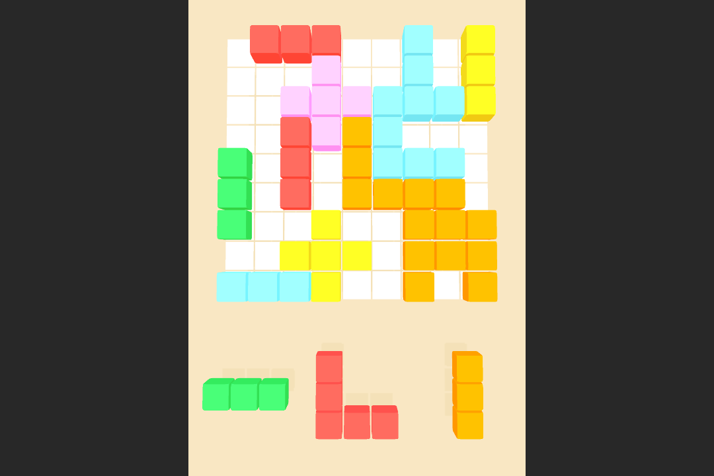

# Block Puzzle 3D Game

Hypercasual game created in the Unity engine. The main object of the game is to form 3x3 squares, rows or complete columns. The chosen mechanic was to merge blocks with the same colors. Blocks generated randomly based on the choice of predefined patterns.

### Implementation

A multidimensional grid is generated with predefined sizes for both the background and blocks.
Raycast is used to determine the location of the mouse in relation to the grid and then compare the block's grid with the background.

When the user clicks, the block's active tiles are marked as active on the grid.

### Videos

Block Puzzle 3D - https://drive.google.com/file/d/1iD61luxqFc8u663-b-NUGCC-VXcVYfhZ/view?usp=drive_link